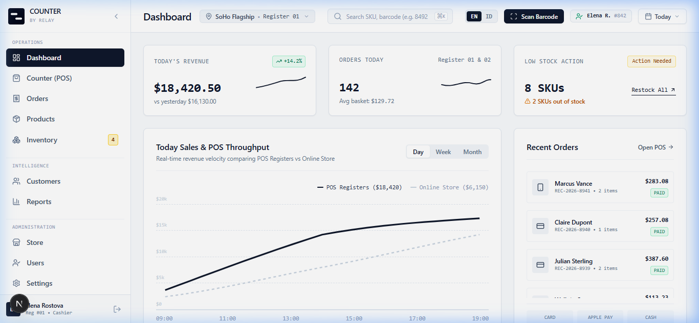

# Counter : Premium Retail Operating System (POS) by Relay

Counter is a commercial-grade retail operating system built for high-throughput retail storefronts and lifestyle brands. Designed with a calm, functional, monochrome editorial aesthetic, Counter eliminates visual noise to deliver software built for 8-hour daily operational use.



---

## 🌟 Key Features

- **📺 Live POS Terminal (Cash Register)**: Real-time cart builder, barcode scanner simulation, customer lookup, discount application, cash tender change calculator, and printable digital receipts.
- **🌐 Bilingual EN / ID Translation**: One-tap toggle between English (EN) and Bahasa Indonesia (ID) covering all labels, menus, tables, and modal dialogs.
- **📈 Dynamic Sales Velocity & Throughput**: SVG sales graph supporting **Day** (Hourly), **Week** (Daily), and **Month** (Monthly) datasets with cursor line-mouseover tooltips.
- **📑 Orders & Receipts Ledger**: Filterable transaction history with slide-out receipt inspector, re-print, and refund triggers.
- **🏷️ Product & Catalog Master**: SKU management, cost price vs selling price, gross margin %, stock status indicators, and EAN-13 barcode tags.
- **📦 Stock Movement Ledger**: Real-time audit log tracking sales deductions, restocks, stock adjustments, and warehouse bin locations ($248,920 stock valuation).
- **👥 Customer CRM Directory**: Retail client profiles featuring loyalty tier tracking (VIP, Gold, Silver), lifetime spend, and visit history.
- **📊 Executive Performance Reports**: Month-to-date gross revenue, profit margin %, return rates, and best-selling product rankings.
- **🔒 Cashier Session Management**: Cashier profile footer with instant session log out.

---

## 🎨 Design System & Brand Identity

- **Monochrome Slate Palette**: Crisp Slate (`#0f172a`), mineral canvas (`#f8fafc`), and ultra-thin 1px borders (`#e2e8f0`).
- **Zero Noise**: No gradients, glassmorphism, glow, heavy drop shadows, or rounded blob buttons.
- **Editorial Typography**: Enforced `tabular-nums` formatting for prices, timestamps, SKUs, and barcodes.
- **Official Relay Logo Mark**: Integrated staggered 45° diagonal Relay brand mark.

---

## 🚀 Quick Start

### Prerequisites
- Node.js 18+ or 20+
- npm or pnpm / yarn

### Installation

1. Clone the repository:
   ```bash
   git clone https://github.com/your-org/counter-relay.git
   cd counter-relay
   ```

2. Install dependencies:
   ```bash
   npm install
   ```

3. Run the development server:
   ```bash
   npm run dev
   ```

4. Open [http://localhost:3000](http://localhost:3000) in your browser.

---

## 🛠️ Tech Stack

- **Framework**: Next.js 16 (App Router + Turbopack)
- **Library**: React 19
- **Styling**: Tailwind CSS v4
- **Icons**: Lucide React Icons
- **Language**: TypeScript

---

## 📄 License

Distributed under the [MIT License](LICENSE).
